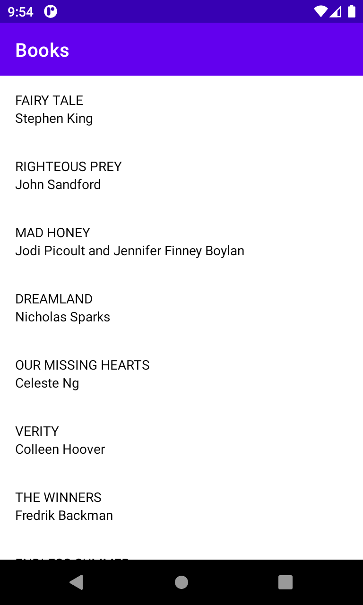
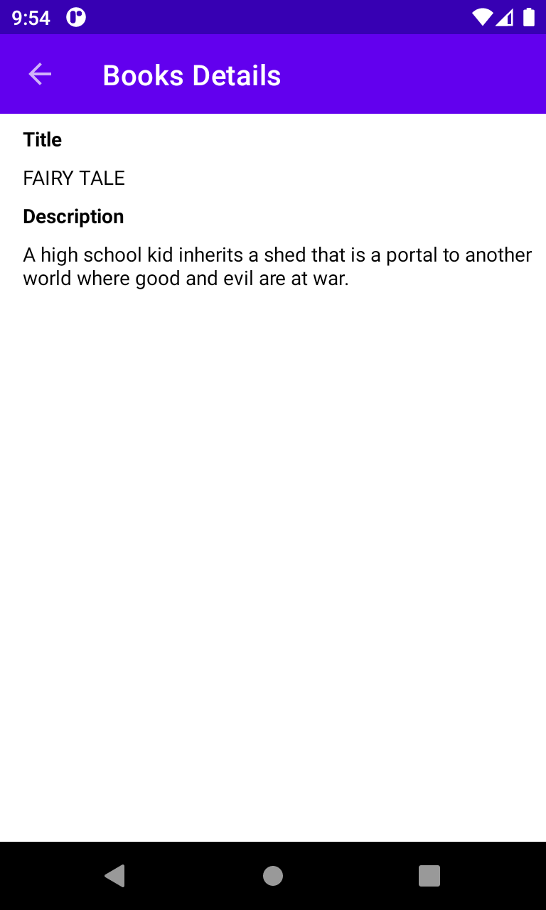

# Nyt Books

App de livros da api pública do New York Times.

# Features
- [x] Lista de livros
- [x] Detalhes do livro
- [x] Testes unitários View Model

# Tecnologias
As seguintes tecnologias foram utilizadas no projeto:

- [Android](https://developer.android.com/)
- [Kotlin](https://kotlinlang.org/)
- [MVVM](https://developer.android.com/jetpack/guide?hl=pt-br)
- [Mokito](https://site.mockito.org/)
- [API Books NYT](https://developer.nytimes.com/apis)

# Screencast

Lista de livros

<h1>
    
</h1>

Detalhes do livro

<h1>
    
</h1>

# Considerações
Aplicativo desenvolvido com objetivos de divulgar e compatilhar meus conhecimentos sobre Dev Android. 

Feito por Kevin Lucas, me siga [Linkedin](https://www.linkedin.com/in/kevinlucasdev/). Obrigado!